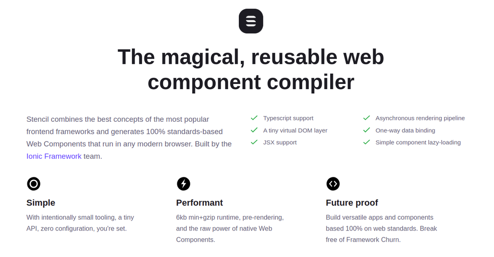
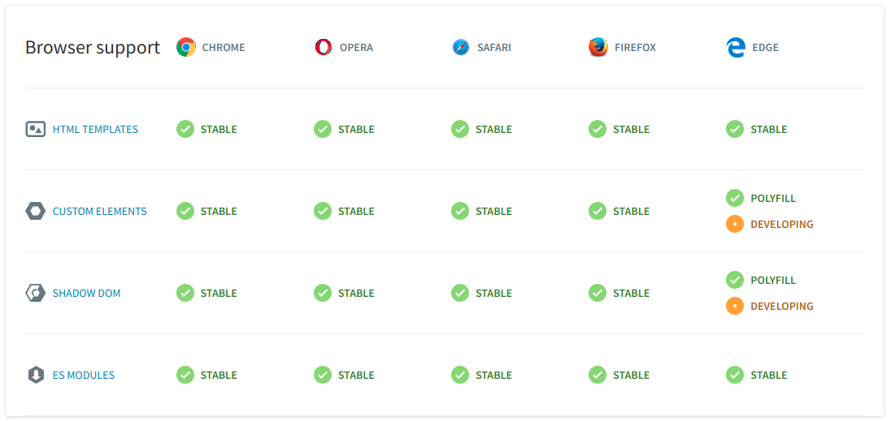

title: Web Components
class: animation-fade
layout: true

<!-- This slide will serve as the base layout for all your slides -->

.top-bar[]
.bottom-bar[
  {{title}}
]

---

class: impact

# {{title}}

## Usando o melhor do navegador

por Sarah Caixeta e Roberto Soares

???
Um tweet sobre cada palestrante

Sarah: 5 anos na TW, TL num projeto utilizando WebComponents para a criação
de uma plataforma de produtos

---

# Agenda

* O que são Web Components?
* Para que servem?
* Trabalhando com Web Components
* O que vem por aí?

---

class: impact color-1

# O que são Web Components?

---

## Elementos nativos

```html
<p></p>
<input />
<audio>...</audio>
<video>...</video>
```

## Seus elementos

```html
<profile-avatar></profile-avatar>
<like-button></like-button>
```

???
HTML já define diversas tags, tão simples quanto um `p` e tão poderosas quanto `video`.
E se você pudesse criar as suas? Desde um botão “like” até elementos mais complexos quanto uma aplicação.

---

## Exemplo

```html
<div class="profile-avatar">
  <a href="...">
    
    <span class="name">...</span>
  </a>
</div>

<script>
<!-- ainda tendo que indicar as informações a serem apresentadas -->
</script>
```

???
Difícil de ser compartilhado e mantido.

---

```js
class ProfileAvatar extends HTMLElement {
  connectedCallback() {
    this.innerHTML = `
      <div class="profile-avatar">
        <a href="...">
          
          <span class="name">...</span>
        </a>
      </div>`
  }
}
customElements.define('profile-avatar', ProfileAvatar)
```

```html
<profile-avatar></profile-avatar>
```

???
- Basicamente você pode colocar seu código JavaScript numa unidade e disponibilizá-la para o navegador.
- Teu HTML ficará bem mais limpo, facilitando a leitura, alterações e todas aquelas coisas maravilhosa.

---

## HTML Templates

```html
<template id="profile-avatar">
  <style>
    a { color: blue }
  </style>
  <a>
    
    <span class="name">...</span>
  </a>
</template>
```

---

## Usando o template

```js
class ProfileAvatar extends HTMLElement {
  constructor() {
    const template = document.getElementById('profile-avatar').content
    this.appendChild(template.cloneNode(true));
  }

  connectedCallback() {
    this.querySelector('a').href = '/my-profile'
    // ...
  }
}
```

---

class: center

```css
h1 { color: red; }
```


---

## Shadow DOM

```js
class ProfileAvatar extends HTMLElement {
  connectedCallback() {
    const content = ...

    const shadow = this.attachShadow({mode: 'open'})
    shadow.appendChild(content)
  }
}
```

---

# Web Components

- Conjunto de especificações da W3C
  - Custom Element
  - Shadow DOM
  - Templates

---

class: impact color-2

# Para que servem?

---

# Compartilhar componentes

.center[
  
]

???
- Público e privado
- Interoperabilidade com outras soluções (React, Angular...)

---

# Criar aplicações

```html
<ytd-app style="--ytd-masthead-height:56px;">
  <yt-activity-manager class="style-scope ytd-app">
  </yt-activity-manager>
  <yt-guide-manager id="guide-service" class="style-scope ytd-app">
  </yt-guide-manager>
  <yt-gfeedback-manager class="style-scope ytd-app">
  </yt-gfeedback-manager>
</ytd-app>
```

---

class: image-right

# Micro frontends


- Compor aplicações
  - [micro-frontends.org](https://micro-frontends.org/)
- Ferramentas:
  - OpenComponents
  - plastic-bag

---

class: impact color-3

# Trabalhando com WebComponents

---

## Vanilla

* Ecossistema JS
  * Webpack
  * Babel
  * TypeScript
* Lifecycle
  * constructor
  * connectedCallback
  * attributeChangedCallback (observedAttributes)
  * disconnectedCallback
* Polyfills

---

class: center



???
- StencilJS
- leve, fácil setup, SSR, TypeScript, decorators
- Ionic

---

class: center


???

- Polymer
- missão desaparecer, divulgar boas práticas
- dividido em bibliotecas, ferramentas
- Google
---



---

class: center


???
- [Vue wrapper](https://github.com/vuejs/vue-web-component-wrapper)
- [Angular elements](https://angular.io/guide/elements)
- https://svelte.technology/guide#custom-elements

---

class: impact color-5

# O que vem por aí?

---

# Outra versão? Sem previsão

- Custom Elements: 2 versões
  - v0, v1
- Angular: 136 versões
- React: 173 versões
  - 0.0.1, 0.0.2, 0.0.3, 0.2.0, ... 0.14.7, 15.0.0, ..., 16.7.0-alpha.2

???
- Estabilidade
  - Compatibilidade
  - Sem migrações de versão

---

# Aumento do suporte

- Polymer
  - lit-element
  - lit-html
- Vue
  - Wrapper
  - Build target
- Svelte
  - Componentes com opção `tag`

???
- Polymer ainda para lançar estável ferramentas como as citadas e mais
- Vue podendo gerar bundle com Web Components
- frameworks “somem” ao compilar utilizando custom element como uma das saídas

---

# Empacotar WebAssembly

.center[
  
]

???
Leitor de PDF, gerador de código de barra, jogos, captchas, editores

---

class: impact color-6

# Obrigada(o)!
## Perguntas?

---

# Referências

* caniuse.com
* https://www.webcomponents.org/
* https://cli.vuejs.org/guide/build-targets.html#web-component
* https://svelte.technology/guide#custom-elements
* https://micro-frontends.org/
* https://medium.com/coinmonks/develop-w3c-web-components-with-webassembly-d65938284255
* https://itnext.io/the-promise-of-webcomponents-webassembly-ad26af56fcf1
