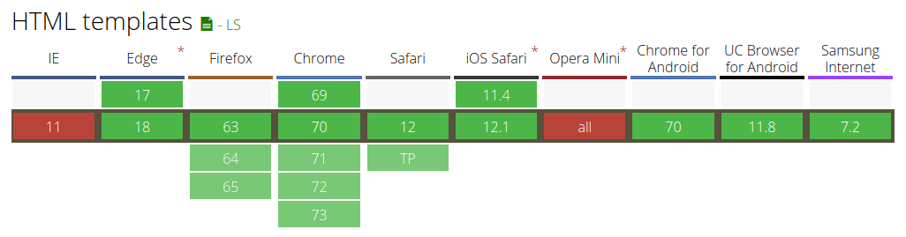

title: Web Components
class: animation-fade
layout: true

<!-- This slide will serve as the base layout for all your slides -->

.top-bar[]
.bottom-bar[
  {{title}}
]

---

class: impact

# {{title}}

## Usando o melhor do navegador

(imagine um fundo branco)

---

# Agenda

* O que são Web Components?
* Para que servem?
* Criando
* O que vem por aí?

---

class: impact color-1

# O que são Web Components?

---

```html
<p></p>
<input />
<audio />
<video />
```

```html
<profile-avatar />
<like-button />
```

???
HTML já define diversas tags, tão simples quanto um `p` e tão poderosas quanto `video`. E se você pudesse criar as suas? Desde um botão “like” até elementos mais complexos quanto uma aplicação.

---

```js
class ProfileAvatar extends HTMLElement {
  // ...
}
customElements.define("profile-avatar", ProfileAvatar);
```

???
Basicamente você pode colocar seu código JavaScript numa unidade e disponibilizá-la para o navegador.

---

```html
<div class="profile-avatar">
  <a href="...">
    
    <span class="name">...</span>
  </a>
</div>

<!-- ainda tendo que indicar as informações a serem apresentadas -->
<profile-avatar />
```

???
Teu HTML ficará bem mais limpo, facilitando a leitura, alterações, e todas aquelas coisas maravilhosas que você pode ler na nova edição de Refactoring por Martin Fowler.

---

```html
class ProfileAvatar extends HTMLElement {
  connectedCallback() {
    this.innerHTML = `
      <div class="profile-avatar">
        <a href="...">
          
          <span class="name">...</span>
        </a>
      </div>`
  }
}
customElements.define('profile-avatar', ProfileAvatar)
```

???
Tudo junto.

---

```
const shadow = this.attachShadow({mode: 'open'})
shadow.appendChild(content)
```

---

> TODO imagens demonstrando o uso de shadow aberto ou fechado. texto fora de cor X e texto interno usando ou não a mesma cor.

```
body {
  color: red;
}
```

---

> TODO Fala de template. Com exemplo.

> TODO Os templates são templates. Limpando o JS.

---

# Web Components

- Conjunto de especificações da W3C
  - Custom Element
  - Shadow DOM
  - Templates

---

class: impact color-2

# Para que servem?

---

# Para que servem?

* Compartilhar componentes
* Criar aplicações
* Micro frontends

---

# Compartilhar componentes

- Públicos ou privados
- Interoperabilidade com outras soluções

---

# Criar aplicações

- YouTube

```html
<ytd-app style="--ytd-masthead-height:56px;">
  <yt-activity-manager class="style-scope ytd-app">
  </yt-activity-manager>
  <yt-guide-manager id="guide-service" class="style-scope ytd-app">
  </yt-guide-manager>
  <yt-gfeedback-manager class="style-scope ytd-app">
  </yt-gfeedback-manager>
</ytd-app>
```

---

# Micro frontends

- Compor aplicações
  - [micro-frontends.org](https://micro-frontends.org/)
- Ferramentas:
  - OpenComponents
  - plastic-bag

---

class: impact color-3

# Criando

---

# Criando

* Ferramentas/Frameworks
* Compatibilidade

---

# Ferramentas

- StencilJS
- Polymer

---

# Compatibilidade

- Browsers
- Frameworks JS
  - [Vue wrapper](https://github.com/vuejs/vue-web-component-wrapper)
  - [Angular elements](https://angular.io/guide/elements)

---

# Browers - Templates



---

class: impact color-5

# O que vem por aí?

---

- Outra versão?
  - Sem previsão
- Frameworks utilizando
  - perquisar: vue usando build, frameworks “somem” ao compilar
- WebAssembly
  - https://medium.com/coinmonks/develop-w3c-web-components-with-webassembly-d65938284255
  - https://itnext.io/the-promise-of-webcomponents-webassembly-ad26af56fcf1

---

class: impact color-6

# Obrigada(o)!
## Perguntas?

---

# Referências

* caniuse.com
  * https://caniuse.com/#search=custom%20element
  * https://caniuse.com/#search=shadow%20dom
  * https://caniuse.com/#feat=template